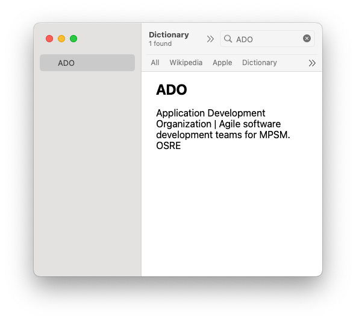

# BuildDict

A Go application that converts CSV files to Apple Dictionary XML format.

## Example



## Requirements

- Go 1.21 or later

## Usage

1. Prepare your CSV file with the following columns:
   - Term (required)
   - Description (required)
   - Tag (optional)

2. Run the program:
   ```bash
   go run main.go input.csv
   ```

3. The program will generate an `output.xml` file in the current directory.

## CSV Format

The CSV file should have the following structure:
```
Term,Description,Tag
example term,This is the description,optional tag
```

## Output

The program generates an XML file in Apple Dictionary format that can be used with the Dictionary Development Kit, found here: https://github.com/SebastianSzturo/Dictionary-Development-Kit

## Making the dictionary

Make desired changes in the sample project plist file(s) and replace the MyDictionary.xml with your new output.xml. `make` should correctly generate the dictionary object, and `make install` will add it to your user Library. You may need to change the makefile to match your environment.

